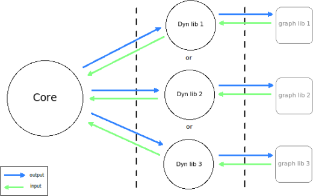

# Project #13 NIBBLER, May 2015
>>>>> #####Multiple UI game. (group project)

#####Grade ``(109/100)`` ``(109/125)*``
--------  -----------------------

Team: [jaguillo](https://github.com/Julow) / [ngoguey](https://github.com/Ngoguey42).
<BR>

#####Goals:
- [X] Implement a 'snake game'
- [X] Build 1 core program and 3 standalone GUI loaded as dynamic libraries

- [X] Bind keys to dynamically load another GUI while playing.
- [X] Core's main loop mustn't lose control (exit QT and so on)

#####Recommended bonuses:
- [X] A scoring system
- [X] Bonus of food appears for a short period of time
- [X] The head section looks different from the others sections
- [X] The snake speed increases during the game
- [X] The game area has some obstacles
- [X] Sound as a standalone dynamic library
- [ ] Multiplayer
- [ ] Multiplayer through network

#####Our work:
- [X] Deep exploration of C++11 and C++14
- [X] 3 basic GUI: SFML(using sprites), Ncurses, SDL2
- [X] 1 polished GUI: OpenGL 2.0 (glfw3, ftgl)
- [X] 1 Sound Interface: SFMLaudio
- [X] Fine makefile and file tree organization
- [X] A 4th GUI

#####Install:
```sh
#repare brew:
rm -rf ~/Library/Caches/Homebrew/ && brew update && brew upgrade --all && mkdir ~/Library/Caches/Homebrew/
```

```sh
#launch project
git clone https://github.com/Ngoguey42/Nibbler
cd Nibbler
make #installs libraries through brew
LD_LIBRARY_PATH="$HOME/.brew/lib/" ./nibbler --ui=1 -t 15 15
```

```
*
- A grade of 85 was required to validate the project.
- A maximum grade of 125 was reachable.
- Second sessions are organised for failed projects.
```
